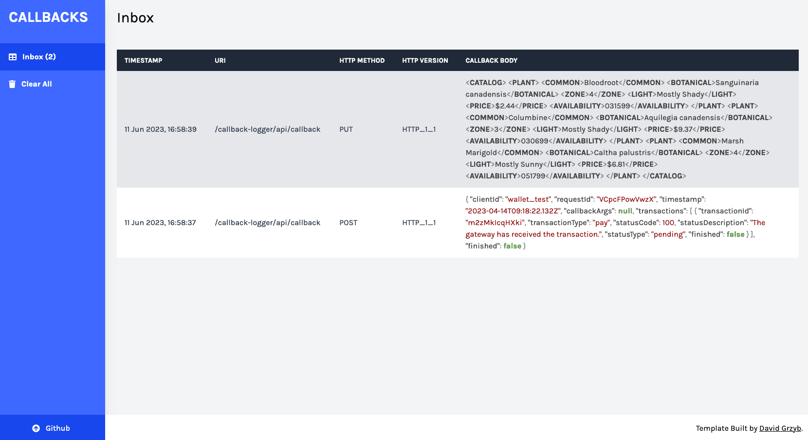

# callback-logger


<a href="https://twitter.com/leeturner" target="_blank">

</a>

> Simple service to receive callbacks. Useful for when testing APIs locally that send callbacks

## 🦿 Prerequisites

- Java 17 or above

## 🛠 Installation

1. Download latest sources and run:
 
 ```shell script
./gradlew build run
```

## ⌨️ Usage

Once up and running you can set the callback url of the API you are testing to the callback endpoint of `callback-logger` - 
`http://localhost:7070/callback-logger/api/callback`.  You can send a callback manually using the following `curl` 
request:

```shell
curl -X POST --location "http://localhost:7070/callback-logger/api/callback" \
    -H "Content-Type: application/json" \
    -d "{\"hello\": \"world\"}"
```

`callback-logger` provides a simple web interface to allow you to see the callbacks you have received.  You can access
the web interface by pointing your browser to `http://localhost:7070/callback-logger`:





## 🥼 Run tests

```shell script
./gradlew test
```

## ✍️ Author

👤 **Lee Turner**

* Mastodon: <a href="https://hachyderm.io/@leeturner" target="_blank">@leeturner</a>
* Twitter: <a href="https://twitter.com/leeturner" target="_blank">@leeturner</a>

Feel free to ping me 😉

## 🤝 Contributing

Contributions are what make the open source community such an amazing place to be learn, inspire, and create. Any
contributions you make are **greatly appreciated**.

1. Open an issue first to discuss what you would like to change.
1. Fork the Project
1. Create your feature branch (`git checkout -b feature/amazing-feature`)
1. Commit your changes (`git commit -m 'Add some amazing feature'`)
1. Push to the branch (`git push origin feature/amazing-feature`)
1. Open a pull request

Please make sure to update tests as appropriate.

## ❤ Show your support

Give a ⭐️ if this project helped you!

<a href="https://www.buymeacoffee.com/leeturner" target="_blank">
    
</a>

## ☑️ TODO

- [ ] Setup releases using jReleaser
- [ ] Add an option to delete callbacks

## 📝 License

```
Copyright © 2023 - Lee Turner

Licensed under the Apache License, Version 2.0 (the "License");
you may not use this file except in compliance with the License.
You may obtain a copy of the License at

   http://www.apache.org/licenses/LICENSE-2.0

Unless required by applicable law or agreed to in writing, software
distributed under the License is distributed on an "AS IS" BASIS,
WITHOUT WARRANTIES OR CONDITIONS OF ANY KIND, either express or implied.
See the License for the specific language governing permissions and
limitations under the License.
```

_This README was generated by [readgen](https://github.com/theapache64/readgen)_ ❤